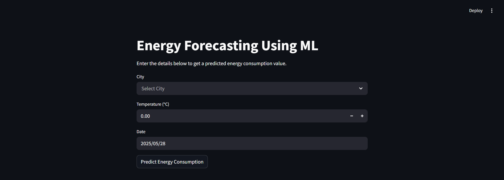

# ⚡ Energy Forecasting Using ML

This project forecasts city-level daily energy consumption based on historical data and temperature trends using advanced machine learning techniques. It provides a user-friendly interface to input city, date, and temperature and outputs the expected energy consumption in kilowatt-hours (kWh). It includes:

- A machine learning pipeline (Random Forest + XGBoost + Linear Regression)
- A Flask backend API for predictions and database storage
- A Streamlit frontend for interactive input and visualization

---

## 📁 Project Structure

```
├── ML_model.py                             # Model training and saving (model.pkl)
├── backend.py                              # Flask API to serve predictions
├── app.py                                  # Streamlit frontend for user interaction
├── requirements.txt                        # Python dependencies
├── .gitignore                              # Ignored files for Git
├── model.pkl                               # Saved stacked regression model
├── energy_prediction.db                    # SQLite database storing prediction records
├── datewise_predicted_consumption_temperature.csv  # Training dataset
```

---

## 🧠 Models Implemented

We use a **Stacking Regressor** that combines the predictions of multiple base models for more robust results:

- **Base Models**:
  - `RandomForestRegressor`
  - `XGBRegressor` (XGBoost)

- **Meta Model**:
  - `LinearRegression` wrapped with `StandardScaler` in a pipeline

This ensemble allows the model to capture both linear and non-linear relationships in the data, improving prediction performance.

---

## 📊 Dataset

The dataset used for training spans from **2019 to 2024**, consisting of:

- Daily **temperature (°C)**
- **City-wise** energy consumption
- Dates (from which time-based features are extracted)

> **Note:** The dataset was synthetically generated with ChatGPT using real-world patterns and climate-consumption relationships to simulate realistic energy usage across multiple cities in Madhya Pradesh.

---

## ✨ Features

- Stacked Regressor: Combines Random Forest & XGBoost with a Linear meta-learner
- Automatic feature engineering from date
- One-hot encoding for `City` to support regional forecasts
- Temperature treated as a continuous feature affecting energy usage
- Real-time prediction API using Flask
- Frontend interface built with Streamlit
- SQLite database logging all predictions
- Multi-city support (across Madhya Pradesh)
- Final model trained and evaluated using MAE, RMSE, and R², and saved as `model.pkl`

---

## 📦 Installation

To install all required dependencies:

```bash
pip install -r requirements.txt
Ensure you have Python 3.7+ installed.
```

---

## 🖼️ User Interface

The app includes a Streamlit frontend for user interaction:

- Select city
- Input date and temperature
- View predicted energy consumption instantly

### 📷 Screenshot



---

## 🗃️ Database
A lightweight SQLite database (energy_prediction.db) stores:

- Date, city, temperature
- Predicted consumption
- (Optional) Actual consumption for evaluation

---

## 🚀 Future Enhancements
- Integrate real-time weather API for temperature input
- Add interactive visual dashboards (trends, comparisons)
- Enable online model retraining from user feedback
- Incorporate DISCOM data like peak demand, load curves

---

## 🙋‍♀️ Contributors
This is a collaborative group project by passionate undergraduates from LNCT College, addressing real-world energy forecasting challenges using ML.

- Haripriya Mahajan (Backend & Model Development)
-- GitHub: https://github.com/Haripriya-Mahajan

- Aditya Garg (Backend & Model Development)
-- GitHub: https://github.com/Adiigarg07

- Nitish Kumar (Frontend with Streamlit)
-- GitHub: https://github.com/nitishkumar1407

- Anjali Patel (Frontend with Streamlit)
-- GitHub: [link pending]
